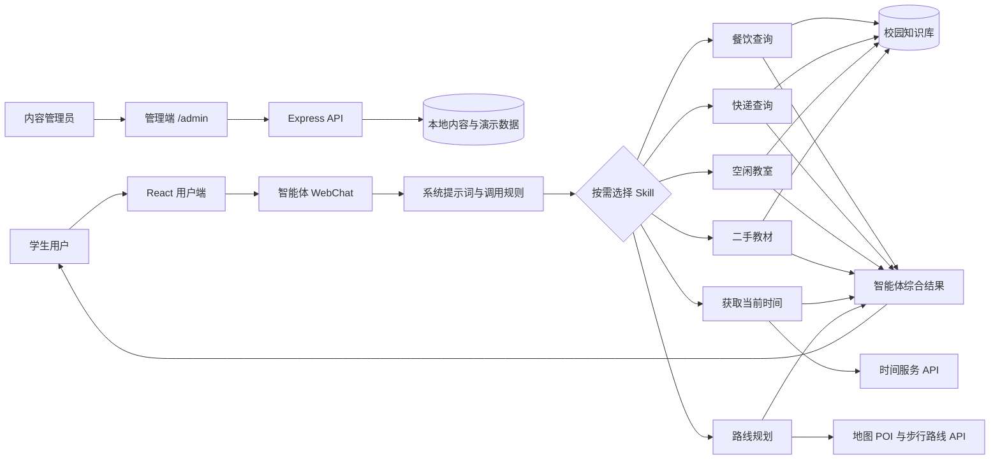

# 整体架构

## 系统关系

## 两层产品结构

### 展示与内容层

- `src/App.tsx`：首页、场景导航、智能体入口与二手发布演示。
- `src/admin.tsx`：首屏卡片、新闻和校园网站管理。
- `server/content-store.ts`：保存管理端内容。
- `server/decision-engine.ts`：无外部服务时可运行的 Mock 决策逻辑。

### 智能体与能力层

- 智能体系统提示词负责确定调用条件、事实边界和回答格式。
- 六个 Skill 是稳定的能力接口。
- 每个 Skill 调用一个已发布工作流 API；工作流内部完成知识检索、HTTP 调用、结构化处理或结果生成。
- 智能体可以串行或并行调用多个 Skill，再按当前时间、结束时间和路线结果综合回答。

## 为什么从大工作流拆成 Skill

初版 MaaS 工作流把意图识别、检索词提取、多个知识库、路线和结果聚合放在同一张图中。功能可见，但节点多、连线长，局部修改容易影响整体，而且简单问题也会经过不必要节点。

第二版在万物平台把每个业务工作流独立发布，再转换为 Skill 供智能体调用。智能体成为路由和编排层，工作流成为可测试的能力层。它减少了意图分流、变量聚合等重复节点，并让六类能力可以独立替换模型、知识库和接口。

## 关键边界

- `VITE_*` 变量会暴露给浏览器，只允许存放公开 URL。
- MaaS、高德等密钥只存在于工作流平台或服务器环境变量中。
- 前端不直接持有地图 Key、Bearer Token 或管理端密码。
- 动态事实必须带来源与更新时间；缺失时明确说明无法确认。
