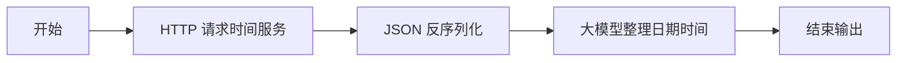
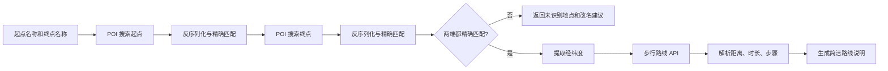

# 时间与路线工作流

## 当前时间工作流

时间模块解决的问题不是“显示一个时钟”，而是为营业、开放、是否来得及和事项先后顺序提供统一基准。

推荐输出包含时区、日期、星期、标准时间和原始时间戳。智能体收到结果后，再与餐饮、快递或教室资料中的明确开放时段比较：多项都可办理时优先处理结束更早的一项；某项已结束则说明原因；资料没有开放信息时必须说“现有资料无法确认”。

时间服务应作为 Linux 后台服务持续运行，由 systemd 或容器负责开机自启。用户不需要登录服务器后手动启动端口；若每次登录才可用，说明服务还没有正确托管。

## 路线规划工作流

路线模块接受起点和终点的地点名称，不要求普通用户手工提供经纬度。

### 为什么要做精确匹配

地图 POI 搜索返回的是候选列表。若直接取第一条，用户输入“地铁 1 号口”时可能被替换成“地铁 2 号口”，路线虽然能算出来，但目标已经错误。因此工作流必须把候选名称与用户原始名称比较，未匹配时停止规划并建议更具体的名称，不能用相似 POI 代替。

### 推荐校验字段

- `match_status_start`、`match_status_end`
- `selected_name_start`、`selected_name_end`
- `origin_location`、`destination_location`
- `distance_meters`、`duration_seconds`
- `steps[]`：方向、道路、距离和动作
- `route_status` 与上游 API 错误信息

### 密钥与日志

地图 Key 必须放在工作流平台的安全变量或服务器密钥管理中，不能出现在前端、Skill 文档和截图里。日志应记录请求耗时、HTTP 状态和匹配状态，但不记录完整 Token 与不必要的用户定位信息。
